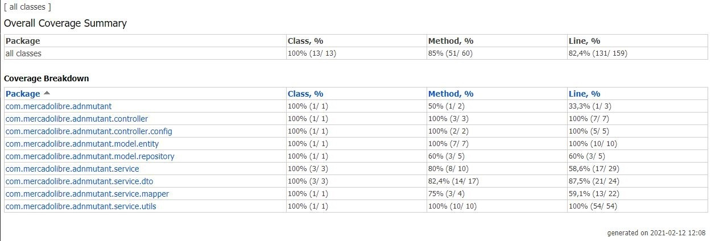

# Reclutando mutantes


## Especificaciones
 [Descargar especificación (Archivo pdf)](./utilREADME/ExamenMercadolibreMutantes.pdf)
 
## Aplicación

La aplicacion fue implementada con: 
 - Java 11
 - Spring Boot 2.4.2
 - Spring JPA
 - Mapstruct
 - Mysql
 - Para las pruebas se trabajó con:
    - junit
    - Mockito
 - swagger (Para documentar la API)
 
## Coverage



## Resumen de cobertura general

//utilREADME/Resumen de cobertura general/index.html

## Ejecución de la aplicación

* La aplicación está expuesta en el repositorio de GitHub, el cual puede descargar de la siguiente ruta:   https://github.com/colme11/adn-mutant.git

* correr el siguiente Script en su base de datos MySql:

	```sh
    //utilREADME/script.sql
    ```


* Modificar los parámetros de conexión a la base de datos según corresponda, el archivo a modificar es el archivo  application.properties

    ```sh
    //adn-mutant/src/main/resources/application.properties
	
	spring.datasource.url=jdbc:mysql://direccion_IP:3306/schema_de_la_base_de_datos
    spring.datasource.username=usuario_base_datos
    spring.datasource.password=contraseña_base_datos
    ```

* Ejecutar aplicacion
    ```diff
    mvn spring-boot:run
    ```

    La aplicación se despliega en el puerto 8090 con path=/mercadolibre/api. Para mayor información de la API, debe ingresar después de desplegada la aplicación a Swagger:
    
    http://```direccion_IP```:8090/mercadolibre/api/swagger-ui.html

## URL de la API Rest expuesta en Google App Engine

